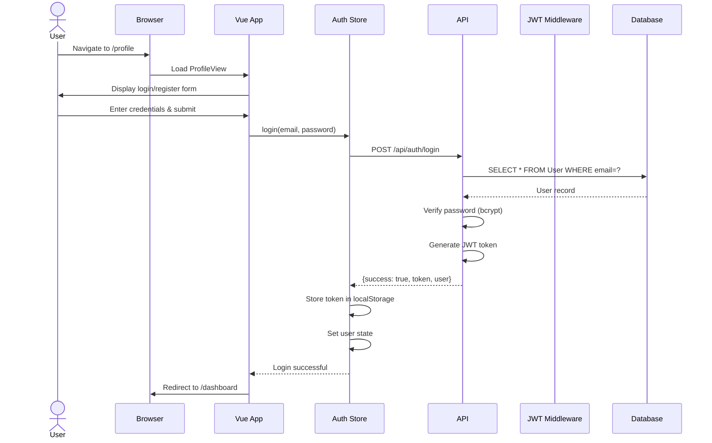
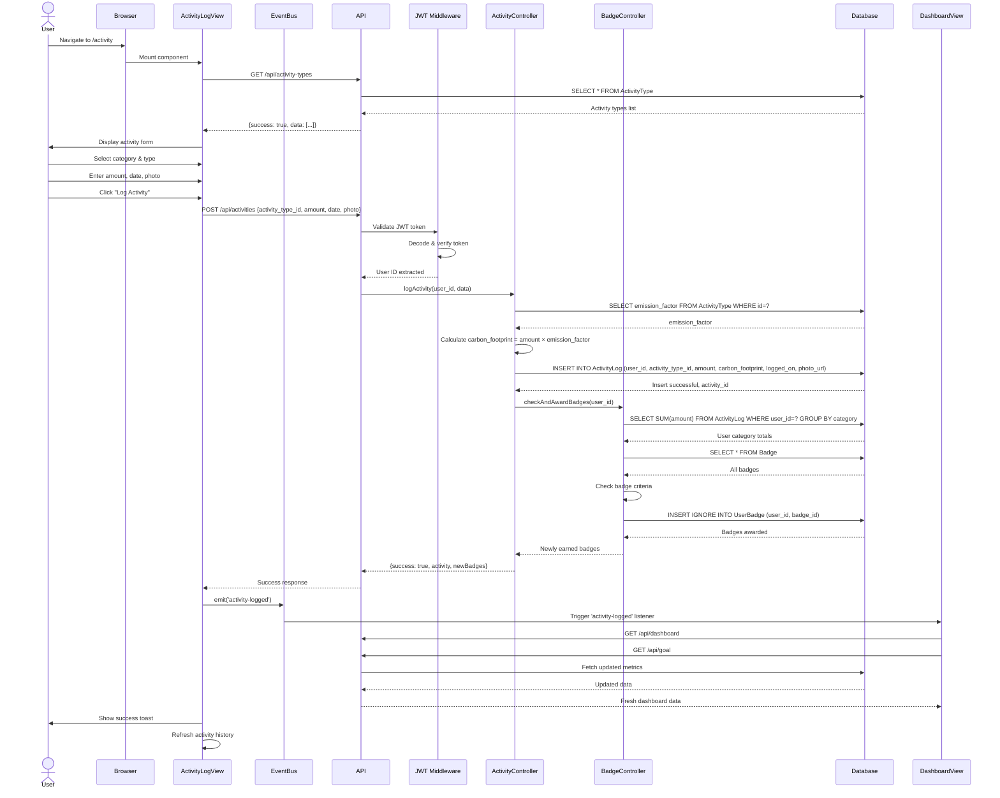
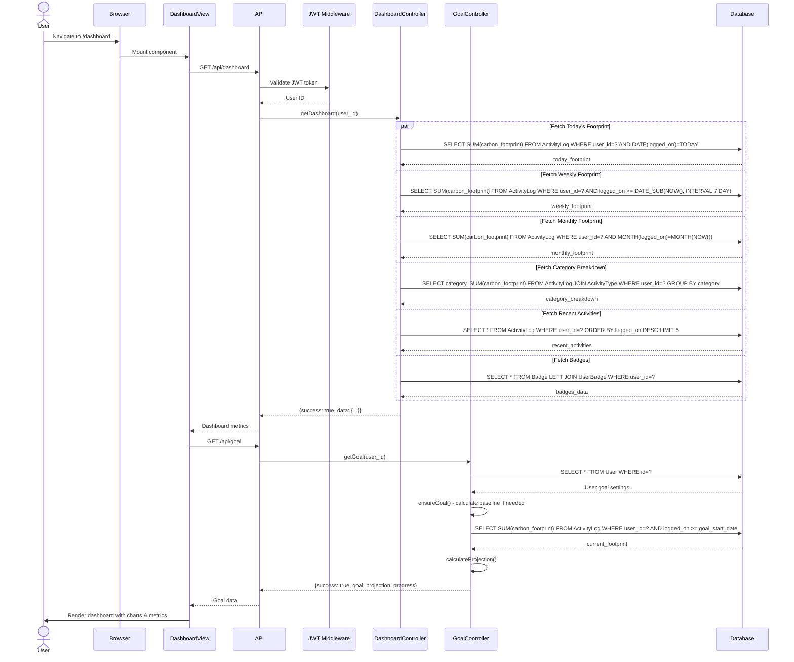
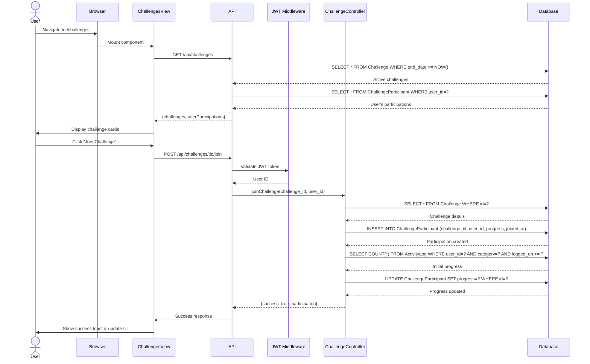
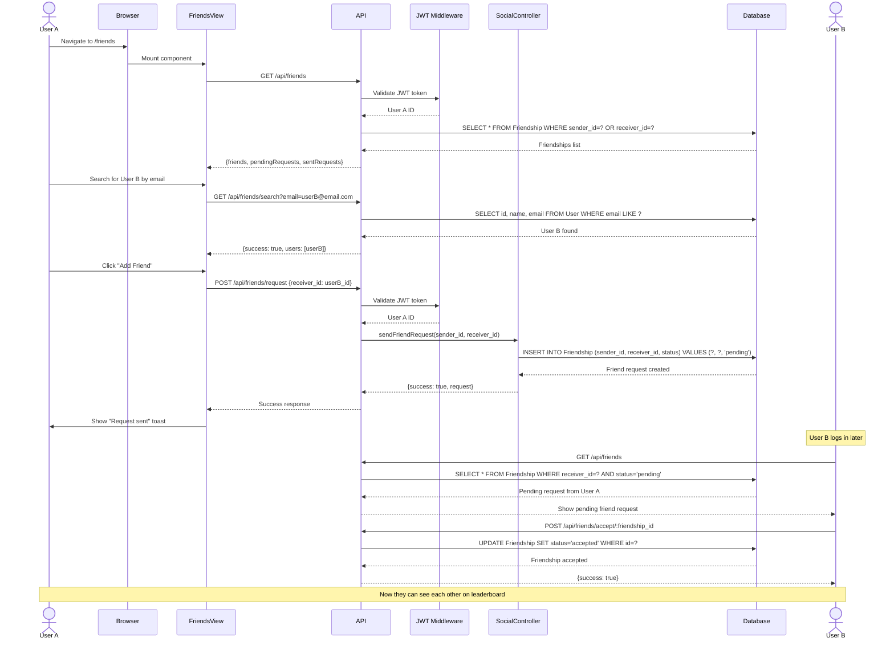
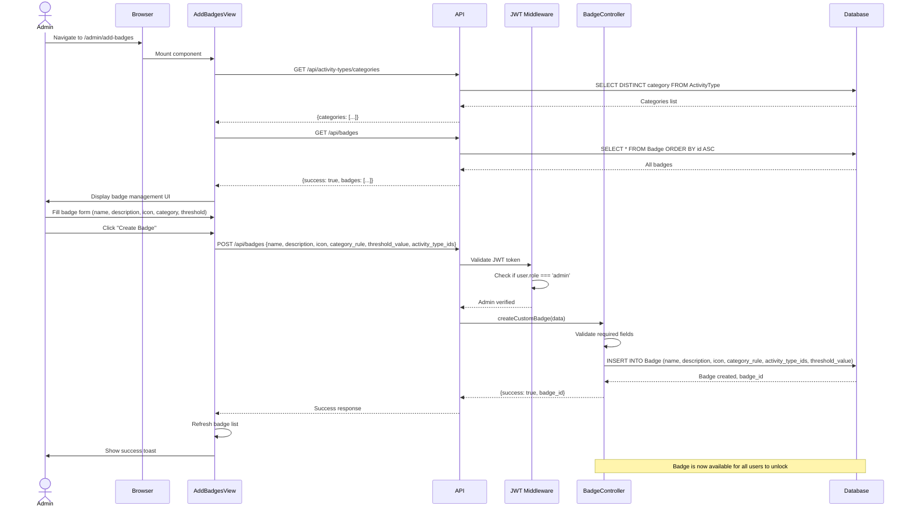
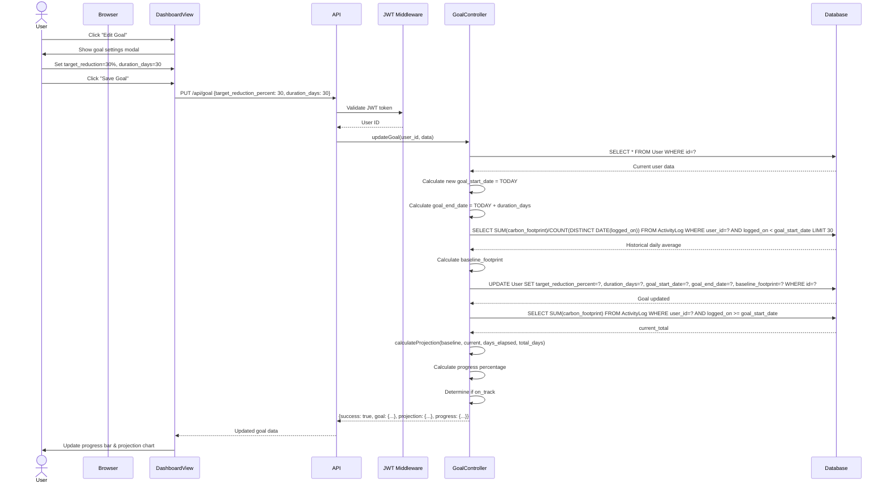
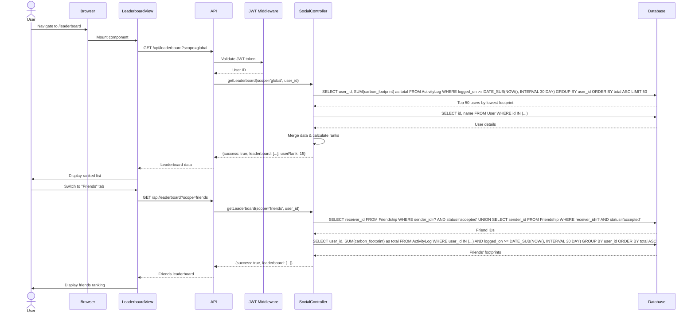

# GreenStep - Sequence Diagrams

## 1. User Authentication Flow



## 2. Activity Logging Flow (Complete)



## 3. Dashboard Data Fetching Flow



## 4. Challenge Join & Progress Tracking Flow



## 5. Friend Connection Flow



## 6. Admin Badge Management Flow



## 7. Goal Update & Projection Calculation Flow



## 8. Leaderboard Ranking Flow



## Notes

- All API requests include JWT token in Authorization header
- JWT Middleware validates token and extracts user_id for all protected routes
- EventBus enables real-time UI updates across components
- Database queries use parameterized statements to prevent SQL injection
- Timezone is set to Asia/Kuala_Lumpur (UTC+8) globally in PHP
- Badge unlocking happens automatically after each activity log
- Goal projections recalculate based on current pace vs baseline
```
