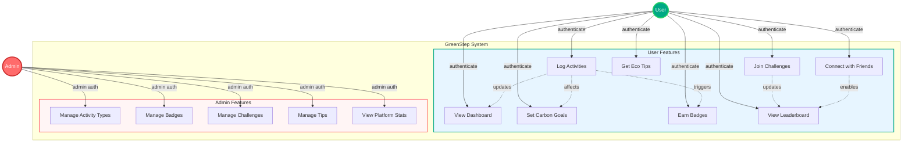

# GreenStep - Use Case Diagram

## Complete System Use Case Diagram

```mermaid
graph TB
    subgraph "GreenStep Carbon Footprint Tracker"
        subgraph "User Management"
            UC1[Register Account]
            UC2[Login]
            UC3[Logout]
            UC4[View Profile]
            UC5[Update Profile]
        end
        
        subgraph "Activity Tracking"
            UC6[Log Activity]
            UC7[View Activity History]
            UC8[Delete Activity]
            UC9[Upload Activity Photo]
            UC10[Filter Activities by Category]
            UC11[Filter Activities by Date]
        end
        
        subgraph "Dashboard & Analytics"
            UC12[View Dashboard]
            UC13[View Today's Footprint]
            UC14[View Weekly Footprint]
            UC15[View Monthly Footprint]
            UC16[View Yearly Footprint]
            UC17[View Category Breakdown]
            UC18[View Activity Charts]
        end
        
        subgraph "Goal Management"
            UC19[Set Carbon Reduction Goal]
            UC20[Update Goal Settings]
            UC21[View Goal Progress]
            UC22[View Goal Projection]
            UC23[Track Daily Progress]
        end
        
        subgraph "Gamification"
            UC24[View Earned Badges]
            UC25[View Available Badges]
            UC26[Unlock Badges Automatically]
            UC27[View Badge Progress]
        end
        
        subgraph "Challenges"
            UC28[View Active Challenges]
            UC29[Join Challenge]
            UC30[Leave Challenge]
            UC31[Track Challenge Progress]
            UC32[View Challenge Leaderboard]
        end
        
        subgraph "Social Features"
            UC33[Search Users]
            UC34[Send Friend Request]
            UC35[Accept Friend Request]
            UC36[Reject Friend Request]
            UC37[Remove Friend]
            UC38[View Friends List]
            UC39[View Friend's Profile]
        end
        
        subgraph "Leaderboard"
            UC40[View Global Leaderboard]
            UC41[View Friends Leaderboard]
            UC42[View Own Ranking]
            UC43[Filter by Time Period]
        end
        
        subgraph "Eco Tips"
            UC44[View Daily Eco Tip]
            UC45[Browse All Tips]
            UC46[Filter Tips by Category]
        end
        
        subgraph "Admin - Platform Management"
            UC47[View Admin Dashboard]
            UC48[View Platform Statistics]
            UC49[View User Dataset]
        end
        
        subgraph "Admin - Emission Factors"
            UC50[Create Activity Type]
            UC51[Update Activity Type]
            UC52[Delete Activity Type]
            UC53[Set Emission Factor]
            UC54[View All Activity Types]
        end
        
        subgraph "Admin - Badge Management"
            UC55[Create Custom Badge]
            UC56[Set Badge Criteria]
            UC57[Delete Badge]
            UC58[View All Badges]
        end
        
        subgraph "Admin - Challenge Management"
            UC59[Create Challenge]
            UC60[Update Challenge]
            UC61[Delete Challenge]
            UC62[Set Challenge Target]
            UC63[Set Challenge Duration]
        end
        
        subgraph "Admin - Tips Management"
            UC64[Create Eco Tip]
            UC65[Delete Eco Tip]
            UC66[Categorize Tips]
        end
    end
    
    User((Regular User))
    Admin((Administrator))
    System[GreenStep System]
    Database[(MySQL Database)]
    
    User --> UC1
    User --> UC2
    User --> UC3
    User --> UC4
    User --> UC5
    User --> UC6
    User --> UC7
    User --> UC8
    User --> UC9
    User --> UC10
    User --> UC11
    User --> UC12
    User --> UC13
    User --> UC14
    User --> UC15
    User --> UC16
    User --> UC17
    User --> UC18
    User --> UC19
    User --> UC20
    User --> UC21
    User --> UC22
    User --> UC23
    User --> UC24
    User --> UC25
    User --> UC27
    User --> UC28
    User --> UC29
    User --> UC30
    User --> UC31
    User --> UC32
    User --> UC33
    User --> UC34
    User --> UC35
    User --> UC36
    User --> UC37
    User --> UC38
    User --> UC39
    User --> UC40
    User --> UC41
    User --> UC42
    User --> UC43
    User --> UC44
    User --> UC45
    User --> UC46
    
    Admin --> UC47
    Admin --> UC48
    Admin --> UC49
    Admin --> UC50
    Admin --> UC51
    Admin --> UC52
    Admin --> UC53
    Admin --> UC54
    Admin --> UC55
    Admin --> UC56
    Admin --> UC57
    Admin --> UC58
    Admin --> UC59
    Admin --> UC60
    Admin --> UC61
    Admin --> UC62
    Admin --> UC63
    Admin --> UC64
    Admin --> UC65
    Admin --> UC66
    
    UC6 -.->|includes| UC26
    UC12 -.->|includes| UC13
    UC12 -.->|includes| UC14
    UC12 -.->|includes| UC17
    UC19 -.->|includes| UC21
    UC29 -.->|includes| UC31
    UC34 -.->|includes| UC33
    
    UC6 --> System
    UC12 --> System
    UC19 --> System
    UC26 --> System
    UC29 --> System
    UC40 --> System
    UC50 --> System
    UC55 --> System
    UC59 --> System
    UC64 --> System
    
    System --> Database
```



## Simplified Use Case Diagram (For Presentation)



## Actor Descriptions

### Regular User
**Primary Actor** - End user who tracks their carbon footprint and participates in eco-friendly activities

**Goals:**
- Track daily carbon footprint
- Reduce environmental impact
- Earn achievements and badges
- Compete with friends
- Learn eco-friendly habits

**Capabilities:**
- Full access to activity logging and tracking features
- Access to social features (friends, leaderboard)
- Access to gamification features (badges, challenges)
- Access to personalized dashboard and analytics
- Access to eco tips and recommendations

### Administrator
**Secondary Actor** - System administrator who manages platform content and configurations

**Goals:**
- Maintain accurate emission factors
- Create engaging challenges and badges
- Provide valuable eco tips
- Monitor platform health and usage

**Capabilities:**
- Full CRUD operations on activity types and emission factors
- Full CRUD operations on badges and challenges
- Full CRUD operations on eco tips
- Access to platform statistics and analytics
- View user dataset overview

## Use Case Relationships

### Include Relationships (mandatory sub-use cases)
- **Log Activity** includes **Unlock Badges Automatically** - Badge checking happens after every activity
- **View Dashboard** includes **View Today's Footprint**, **View Weekly Footprint**, **View Category Breakdown**
- **Set Carbon Goal** includes **View Goal Progress** - Progress is calculated when goal is set
- **Join Challenge** includes **Track Challenge Progress** - Progress tracking starts immediately

### Extend Relationships (optional extensions)
- **Log Activity** extends to **Upload Activity Photo** - Photo upload is optional
- **View Activity History** extends to **Filter by Category** or **Filter by Date** - Filtering is optional
- **View Leaderboard** extends to **Filter by Time Period** - Time filtering is optional

## System Boundaries

**Within System:**
- All user authentication and authorization
- Activity logging and carbon calculation
- Badge unlocking logic
- Challenge progress tracking
- Friend connection management
- Leaderboard ranking calculation
- Dashboard analytics generation
- Admin CRUD operations

**Outside System:**
- User's device camera (for photo capture)
- User's local storage (for JWT token persistence)
- Railway deployment infrastructure
- External time/date services (server timezone)

## Key Use Case Flows

### Primary Use Case: Log Activity
1. User navigates to Activity Log page
2. System displays activity form with categories and types
3. User selects category and activity type
4. User enters amount and date
5. User optionally uploads photo
6. User submits form
7. System validates input
8. System calculates carbon footprint
9. System saves activity to database
10. System checks and awards badges
11. System updates dashboard metrics
12. System displays success message

### Primary Use Case: Set Carbon Reduction Goal
1. User navigates to Dashboard
2. User clicks "Set Goal" or "Edit Goal"
3. System displays goal settings modal
4. User enters target reduction percentage and duration
5. User submits goal
6. System calculates baseline from historical data
7. System sets goal start and end dates
8. System saves goal to database
9. System calculates initial projection
10. System displays updated goal progress bar

### Admin Use Case: Create Custom Badge
1. Admin navigates to Badge Management page
2. System displays badge creation form
3. Admin enters badge name, description, icon
4. Admin selects category rule and threshold value
5. Admin optionally selects specific activity types
6. Admin submits form
7. System validates input
8. System creates badge in database
9. System makes badge available for all users
10. System displays success message
```
